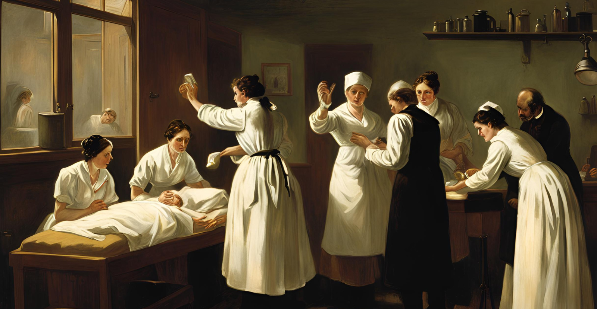

# The Numbers Behind the Breakthrough: Semmelweis's Handwashing Data Revisited



## Overview
This repository contains a data analysis project that revisits the groundbreaking work of Dr. Ignaz Semmelweis, a Hungarian physician who discovered the importance of handwashing in preventing childbed fever in the 1840s. Using historical data from the Vienna General Hospital, this project demonstrates how modern data analysis tools and statistical methods can validate Semmelweis's findings and highlight the profound impact of hand hygiene on reducing mortality rates.

## Project Structure
The repository is organized as follows:
- **[notebook.ipynb](notebook.ipynb)**: The Jupyter Notebook with the full analysis, including data exploration, visualisation, and statistical methods.
- **[datasets/](datasets)**: Includes the dataset used for the analysis (e.g., `monthly_death.csv` and `yearly_deaths_by_clinic.csv`).
- **README.md**: This file, providing an overview of the project.
- **[requirements.txt](requirements.txt)**: Lists the Python libraries required to run the analysis.

## Key Findings
- Handwashing reduced the **proportion of deaths** from childbed fever by **8 percentage points**, from an average of **10%** to **2%**.
- A **bootstrap analysis** confirmed that the reduction in mortality rates was statistically significant, with a **95% confidence interval** of **6.7 to 10 percentage points**.
- The analysis highlights the tragic resistance Semmelweis faced from the medical community, despite the overwhelming evidence supporting his discovery.

## Tools and Technologies Used
- **Python**: Primary programming language for data analysis.
- **Pandas**: Data manipulation and cleaning.
- **NumPy**: Numerical computations.
- **Matplotlib**: Data visualisation.
- **Jupyter Notebook**: Interactive analysis and documentation.

## How to Use This Repository
1. **Clone the Repository**:
   ```bash
   git clone https://github.com/your-username/semmelweis-handwashing-analysis.git
   cd semmelweis-handwashing-analysis
   ```
2. **Set Up the Environment**:
   Install the required Python libraries using `requirements.txt`:
   ```bash
   pip install -r requirements.txt
   ```
3. **Run the Analysis**:
   Open the Jupyter Notebook (`notebooks.ipynb`) and execute the cells to reproduce the analysis.

## Dataset
The dataset used in this project contains the number of births and deaths at the Vienna General Hospital from 1841 to 1846. It is located in the `datasets/` directory.

## Contributing
Contributions to this project are welcome! If you have suggestions for improving the analysis or visualisations, please open an issue or submit a pull request.

## License
This project is licensed under the MIT License. See the [LICENSE](LICENSE) file for details.

## Acknowledgments
- Dr. Ignaz Semmelweis for his pioneering work in medical hygiene.
- The Vienna General Hospital for maintaining and providing access to historical medical records.
- Modern data science tools that allow us to revisit and validate historical discoveries with statistical rigor.

---

Explore the notebook to see how data analysis can uncover the life-saving impact of handwashing and honor the legacy of Dr. Semmelweis!